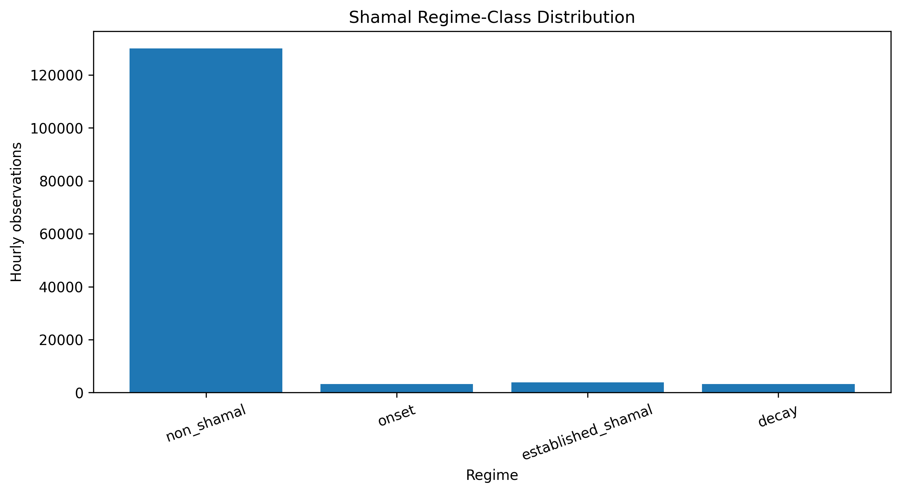

# SAMGT: Shamal-Aware Multi-Scale Graph Transformer for Multi-Horizon Wind Vector Forecasting

[](https://www.python.org/)
[](https://pytorch.org/)
[](https://jupyter.org/)
[](#license)

Official research implementation of **SAMGT (Shamal-Aware Multi-Scale Graph Transformer)**, a spatiotemporal deep-learning framework for **multi-horizon wind-vector forecasting over the Persian Gulf and Gulf of Oman**.

The project is designed to forecast future 10-m wind-vector components while explicitly accounting for:

- multiple atmospheric temporal scales,
- spatial relationships between marine grid cells,
- Shamal wind regimes and transition periods,
- causal forecasting constraints,
- multi-horizon prediction,
- chronological and leakage-safe model evaluation.

---

## Overview

Wind forecasting over the Persian Gulf and Gulf of Oman is complicated by strong spatial coupling, temporal variability across several scales, and episodic regional phenomena such as **Shamal winds**.

This project formulates the forecasting problem as a **causal multi-horizon wind-vector prediction task**.

For each forecast issue time \(t\), the model uses historical zonal and meridional 10-m wind components

\[
u_{10}, \quad v_{10}
\]

and predicts their future values at:

\[
t+1,\quad t+3,\quad t+6,\quad t+12,\quad t+24\text{ hours}.
\]

The main proposed model, **SAMGT**, combines:

1. multi-scale temporal representations,
2. graph-based spatial information exchange,
3. Transformer-based temporal modeling,
4. Shamal-regime awareness,
5. multi-task wind-vector and regime prediction.

The project also contains ablation models that isolate the contributions of graph connectivity and Shamal awareness.

---

# Proposed Model

## SAMGT

**SAMGT** stands for:

> **Shamal-Aware Multi-Scale Graph Transformer**

The model is designed around three characteristics of the regional wind field.

### Multi-scale temporal dynamics

Historical wind observations are divided into three temporal scales.

| Temporal scale | Historical lags |
|---|---|
| Short-term | 0, 1, 2, 3, 6 h |
| Diurnal | 12, 24, 48 h |
| Synoptic | 72, 120, 168 h |

The maximum historical context is therefore:

\[
168\text{ hours} = 7\text{ days}.
\]

These temporal groups allow the network to represent rapidly changing local conditions, diurnal variability, and longer synoptic-scale atmospheric behavior separately.

---

### Spatial graph representation

The study domain is represented using **512 marine grid cells** covering the Persian Gulf and Gulf of Oman.

The grid contains:

- 357 Persian Gulf cells
- 155 Gulf of Oman cells

Spatial relationships between neighboring grid cells are incorporated through graph-based operations.

This allows information to propagate between physically neighboring locations rather than treating every grid point as an independent sample.

---

### Shamal-awareness

SAMGT includes an auxiliary Shamal-regime modeling component.

Four atmospheric regimes are considered:

| Class | Regime |
|---:|---|
| 0 | Non-Shamal |
| 1 | Shamal onset / pre-event transition |
| 2 | Established Shamal |
| 3 | Shamal decay / post-event transition |

Importantly, **future true Shamal labels are never supplied directly as forecasting inputs**.

The full SAMGT model instead learns regime probabilities from information that is causally available at forecast time.

True future regime labels are used only for training the auxiliary classification objective and for regime-conditioned evaluation.

This design prevents future-information leakage.

---

# Forecasting Task

The target is the future 10-m wind vector:

\[
\mathbf{V}(t+h)
=
\left[
u_{10}(t+h),
v_{10}(t+h)
\right]
\]

for forecast horizons

\[
h \in \{1,3,6,12,24\}\text{ hours}.
\]

The model therefore produces wind-vector predictions for five forecast horizons simultaneously.

Historical predictors include:

- `u10_history`
- `v10_history`
- latitude
- longitude
- cyclic hour-of-day encoding
- cyclic day-of-year encoding

Targets include:

- `u10_target`
- `v10_target`

---

# Study Domain

The study domain covers marine grid cells in the:

- **Persian Gulf**
- **Gulf of Oman**

The final study grid contains **512 unique marine locations** at a spatial resolution of approximately **0.25°**.

The meteorological data have an hourly temporal resolution.

The preprocessing pipeline preserves:

- `study_id`
- original grid identifier
- latitude
- longitude
- basin assignment
- hourly timestamp
- `u10`
- `v10`

---

# Data Period

The complete study period is:

```text
2005–2020
```

A strictly chronological split is used.

| Dataset | Period |
|---|---|
| Training | 2005–2017 |
| Validation | 2018–2019 |
| Independent test | 2020 |

The independent 2020 period is intentionally excluded from model fitting and model selection.

---

## Leakage-safe splitting

Because forecasts extend up to +24 hours, dividing the dataset only according to forecast issue time can cause leakage across chronological boundaries.

For example, a forecast generated during the final hours of 2017 could contain a +24 h target located in 2018.

The data-splitting pipeline therefore ensures that:

\[
t+h_{\max}
\]

remains within the same chronological partition.

Boundary samples that would cross into the following partition are removed.

All feature scalers are fitted using **training data only**.

---

# Shamal Identification

The project contains a dedicated Shamal-regime identification stage.

The primary event definition uses strong northwesterly-to-northerly wind conditions approximately corresponding to:

\[
287^\circ \leq \theta \leq 360^\circ
\]

with hourly wind speed:

\[
V \geq 9.85\ \text{m s}^{-1}.
\]

Additional criteria include:

- qualifying conditions for at least 3 hours during a day,
- at least 2 consecutive qualifying Shamal days,
- regional detection based on more than 50% of Persian Gulf study cells satisfying the local criterion.

Two days immediately before and after an established event are treated as operational Shamal transition periods.

The resulting labels are:

```text
0 = non-Shamal
1 = onset
2 = established Shamal
3 = decay
```

The identification procedure detected **68 established events** and **162 established-event days** over the analyzed period in the current implementation.

---

# Repository Structure

```text
SAMGT-Wind-Forecasting/
│
├── README.md
├── requirements.txt
├── .gitignore
├── LICENSE
├── CITATION.cff
│
├── notebooks/
│   ├── 01_data_audit.ipynb
│   ├── 02_preprocessing.ipynb
│   ├── 03_feature_engineering.ipynb
│   ├── 04_data_split_and_scaling_new.ipynb
│   ├── 05_shamal_regime_identification.ipynb
│   └── 06_full_model_training_KAGGLE (5).ipynb
│
├── src/
│   └── models/
│
├── data/
│   └── processed/
│       ├── study_grid.csv
│       └── ...
│
├── outputs/
│   ├── figures/
│   │   └── shamal/
│   └── tables/
│
├── prepare_kaggle_training_upload.py
│
└── requirements.txt
```

Large datasets, generated NetCDF files, trained model weights, and temporary Kaggle bundles are intentionally **not stored in this GitHub repository**.

---

# Workflow

The complete workflow is organized into sequential notebooks.

## 01 — Data Audit

```text
notebooks/01_data_audit.ipynb
```

This notebook inspects the original meteorological datasets and constructs the final marine study grid.

Main tasks include:

- auditing annual NetCDF files,
- inspecting coordinates and temporal coverage,
- defining marine grid cells,
- separating Persian Gulf and Gulf of Oman locations,
- removing duplicate boundary cells,
- creating the final 512-cell study grid.

Main output:

```text
data/processed/study_grid.csv
```

---

## 02 — Preprocessing

```text
notebooks/02_preprocessing.ipynb
```

Spatially preprocesses the hourly wind data.

The notebook:

- loads the study grid,
- validates annual raw datasets,
- extracts the exact 512 study locations,
- preserves hourly `u10` and `v10`,
- preserves geographic metadata,
- checks for missing values,
- writes one processed NetCDF file per year.

Output:

```text
data/processed/yearly/
├── 2005.nc
├── 2006.nc
├── ...
└── 2020.nc
```

---

## 03 — Multi-Scale Feature Engineering

```text
notebooks/03_feature_engineering.ipynb
```

Transforms the hourly wind fields into the causal multi-horizon forecasting dataset.

Historical lags:

```text
0, 1, 2, 3, 6,
12, 24, 48,
72, 120, 168 h
```

Forecast horizons:

```text
1, 3, 6, 12, 24 h
```

The notebook generates:

```text
u10_history
v10_history

u10_target
v10_target

hour_sin
hour_cos

doy_sin
doy_cos
```

and records the exact temporal-scale and forecast-horizon schemas used by the models.

---

## 04 — Data Splitting and Scaling

```text
notebooks/04_data_split_and_scaling_new.ipynb
```

Creates the leakage-safe chronological train/validation/test partitions.

The notebook performs:

- chronological splitting,
- +24 h target-boundary protection,
- training-only feature scaling,
- training-only target scaling,
- spatial-coordinate standardization,
- scaler serialization,
- split-manifest generation.

Split:

```text
Training:   2005–2017
Validation: 2018–2019
Test:       2020
```

The 2020 period remains untouched during training and model selection.

---

## 05 — Shamal Regime Identification

```text
notebooks/05_shamal_regime_identification.ipynb
```

Generates ground-truth Shamal event and transition labels.

Four classes are produced:

```text
Non-Shamal
Onset
Established Shamal
Decay
```

Outputs include Shamal event catalogs, hourly labels, regime summaries, sensitivity analyses, and diagnostic figures.

Example figures are stored under:

```text
outputs/figures/shamal/
```

including:

```text
annual_shamal_event_count.png
monthly_shamal_day_distribution.png
shamal_regime_class_distribution.png
```

---

## 06 — Model Training

```text
notebooks/06_full_model_training_KAGGLE (5).ipynb
```

Performs GPU-based model training.

The notebook is designed primarily for **Kaggle GPU execution** and saves:

- best model checkpoints,
- training histories,
- experiment configurations,
- model metadata,
- training tables,
- downloadable output archives.

The independent 2020 test set is **not used for model selection in this notebook**.

---

# Models

The modeling framework contains conventional baselines, recent architecture-inspired comparison models, and SAMGT ablations.

| Model | Purpose |
|---|---|
| `GRU` | Conventional recurrent baseline |
| `TransformerLSTM_2026` | Transformer/recurrent comparison architecture |
| `GraphTransformer_2025` | Graph + Transformer comparison architecture |
| `MS_NoGraph` | Multi-scale model without graph modeling |
| `MS_Graph_NoShamal` | Multi-scale graph model without Shamal awareness |
| `SAMGT_Full` | Full proposed architecture |

The principal ablation chain is:

```text
MS_NoGraph
      ↓
MS_Graph_NoShamal
      ↓
SAMGT_Full
```

This allows the effects of spatial graph modeling and Shamal-regime awareness to be evaluated separately.

The comparison implementations are intended as **controlled adapted baselines**, not necessarily line-by-line reproductions of the original published architectures.

---

# Current SAMGT Training Configuration

The current full-experiment configuration uses approximately:

```text
Embedding dimension:       64
Attention heads:           4
Temporal layers:           2
Graph layers:              2
Graph neighbors:           8
Learning rate:             3e-4
Batch issue times:         16
Maximum epochs:            20
Early-stopping patience:   4
Mixed precision:           enabled on CUDA
Random seed:               42
```

These values may evolve as the experimental study is finalized.

---

# Installation

Clone the repository:

```bash
git clone https://github.com/kamyarmikaeelzade/SAMGT-Wind-Forecasting.git
cd SAMGT-Wind-Forecasting
```

Create a virtual environment:

```bash
python -m venv .venv
```

Activate it on Linux/macOS:

```bash
source .venv/bin/activate
```

or on Windows:

```powershell
.venv\Scripts\activate
```

Upgrade `pip`:

```bash
python -m pip install --upgrade pip
```

Install dependencies:

```bash
pip install -r requirements.txt
```

---

# Main Python Dependencies

The project uses:

```text
numpy
pandas
xarray
netCDF4
matplotlib
jupyter
ipykernel
regionmask
geopandas
shapely
scikit-learn
joblib
torch
tqdm
```

A CUDA-capable GPU is strongly recommended for full model training.

---

# Running the Preprocessing Pipeline

Launch Jupyter:

```bash
jupyter notebook
```

Then execute the notebooks sequentially:

```text
01_data_audit.ipynb
        ↓
02_preprocessing.ipynb
        ↓
03_feature_engineering.ipynb
        ↓
04_data_split_and_scaling_new.ipynb
        ↓
05_shamal_regime_identification.ipynb
        ↓
06_full_model_training_KAGGLE (5).ipynb
```

The notebooks contain integrity checks and should generally be run in order because later stages depend on metadata generated by earlier stages.

---

# Preparing the Kaggle Training Dataset

The repository contains:

```text
prepare_kaggle_training_upload.py
```

Run it from the project root:

```bash
python prepare_kaggle_training_upload.py
```

The script collects the files needed for model training while preserving the expected project-relative directory structure.

It creates a Kaggle training package containing the required:

- vector feature files,
- study grid,
- Shamal labels,
- split metadata,
- temporal-scale schema,
- forecast-horizon schema,
- training scalers.

The generated bundle itself is intentionally excluded from Git.

---

# Expected Kaggle Input Structure

The training notebook expects a structure similar to:

```text
wind-paper-ready-data/
│
├── data/
│   ├── processed/
│   │   ├── study_grid.csv
│   │   ├── vector_features/
│   │   │   ├── 2005.nc
│   │   │   ├── 2006.nc
│   │   │   ├── ...
│   │   │   └── 2020.nc
│   │   │
│   │   └── shamal/
│   │       └── shamal_hourly_labels.nc
│   │
│   └── splits/
│       └── vector/
│           └── split_manifest.csv
│
└── outputs/
    ├── models/
    │   ├── vector_history_scaler.joblib
    │   ├── vector_target_scaler.joblib
    │   └── vector_spatial_scaler.joblib
    │
    └── tables/
        ├── temporal_scale_schema.csv
        ├── forecast_horizon_schema.csv
        └── shamal_split_regime_summary.csv
```

---

# Data Availability

Large meteorological datasets are **not included in this repository**.

In particular, the repository does not track:

```text
data/raw/
data/processed/yearly/
data/processed/vector_features/
large NetCDF files
trained model checkpoints
Kaggle upload bundles
```

This keeps the Git repository lightweight and avoids distributing large generated datasets through source control.

Small reproducibility files such as schemas, split manifests, configuration tables, and study-grid metadata may be retained in the repository.

A permanent dataset/archive link can be added here when the research dataset is published:

```text
Dataset DOI: TBD
Dataset repository: TBD
```

---

# External Geographic Data

The project uses geographic boundary information during study-grid construction.

External geographic datasets are not redistributed directly through this repository when their licensing terms restrict redistribution.

Users should obtain external datasets from their original providers and follow the applicable attribution and licensing requirements.

---

# Reproducibility

Several safeguards are used to improve experiment reproducibility.

### Fixed random seeds

The training pipeline initializes random seeds for:

```python
random
numpy
torch
torch.cuda
```

with the current default:

```text
SEED = 42
```

### Chronological evaluation

No random train/test splitting is used.

### Training-only scaling

All fitted scalers use training-period information only.

### Independent test period

The 2020 dataset is reserved for final independent evaluation.

### Causal predictors

Predictors use only information available at or before forecast issue time.

### Shamal leakage protection

Future true Shamal labels are not provided as forecast inputs.

---

# Output Files

Experiment outputs are organized under:

```text
outputs/
```

Typical outputs include:

```text
outputs/
├── figures/
├── models/
└── tables/
```

Small figures and tables useful for documenting the study may be version-controlled.

Large checkpoints and generated training artifacts are excluded from Git.

---

# Example Shamal Diagnostics

The Shamal identification workflow produces diagnostic plots such as:



Additional figures include:

```text
outputs/figures/shamal/annual_shamal_event_count.png
outputs/figures/shamal/monthly_shamal_day_distribution.png
```

---

# Methodological References for Shamal Identification

The Shamal-event definition and transition analysis are informed by the following literature:

1. Al-Senafi, F., & Anis, A. (2015). *Shamals and climate variability in the Northern Arabian/Persian Gulf from 1973 to 2012.* International Journal of Climatology.  
   DOI: `10.1002/joc.4302`

2. Yu, Y., Notaro, M., Kalashnikova, O. V., & Garay, M. J. (2016). *Climatology of summer Shamal wind in the Middle East.* Journal of Geophysical Research: Atmospheres.  
   DOI: `10.1002/2015JD024063`

3. Li, D., Anis, A., & Al Senafi, F. (2020). *Physical response of the Northern Arabian Gulf to winter Shamals.* Journal of Marine Systems, 203, 103280.  
   DOI: `10.1016/j.jmarsys.2019.103280`

The implemented regional definition is explicitly recorded in the generated configuration tables to make the event-identification procedure reproducible.

---

# Research Status

This repository accompanies ongoing research on:

> **Shamal-transition-aware multi-scale graph learning for multi-horizon wind-vector forecasting over the Persian Gulf and Gulf of Oman.**

The repository currently contains the preprocessing, feature-engineering, leakage-safe splitting, Shamal-identification, and GPU training stages.

The final independent evaluation on the held-out **2020 test period** is intentionally separated from model training and model selection.

Results should therefore be interpreted according to the specific released experiment version.

---

# Citation

If you use this code in academic work, please cite the associated paper once publication information becomes available.

```bibtex
@article{samgt2026,
  title   = {A Shamal-Transition-Aware Multi-Scale Graph Transformer for Multi-Horizon Wind Vector Forecasting over the Persian Gulf and Gulf of Oman},
  author  = {Author information to be added},
  journal = {To be added},
  year    = {2026},
  doi     = {To be added}
}
```

A `CITATION.cff` file should also be provided with the final publication release.

---

# License

The source-code license will be specified in the repository `LICENSE` file.

Please note that external meteorological and geographic datasets may be governed by licenses that are separate from the source-code license.

A software license does **not** automatically grant redistribution rights for third-party datasets.

---

# Contributing

This repository primarily serves as research code accompanying an academic study.

Bug reports, reproducibility issues, and technically relevant suggestions are welcome through GitHub Issues.

When reporting an issue, please include:

- operating system,
- Python version,
- relevant package versions,
- notebook/script being executed,
- complete error message,
- enough information to reproduce the problem.

---

# Repository

GitHub:

https://github.com/kamyarmikaeelzade/SAMGT-Wind-Forecasting

---

# Acknowledgements

This research uses open-source scientific Python tools including NumPy, Pandas, Xarray, scikit-learn, GeoPandas, Matplotlib, PyTorch, and Jupyter.

The authors also acknowledge the providers of the meteorological and geographic datasets used in the study.

---

## Disclaimer

This repository is intended for scientific research and reproducibility.

Model outputs should not be interpreted as operational meteorological forecasts without additional validation appropriate to the intended application.
